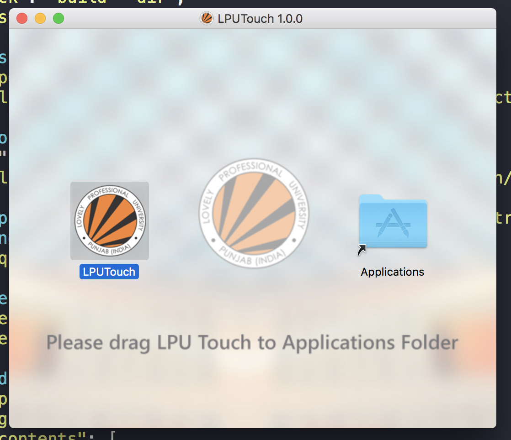
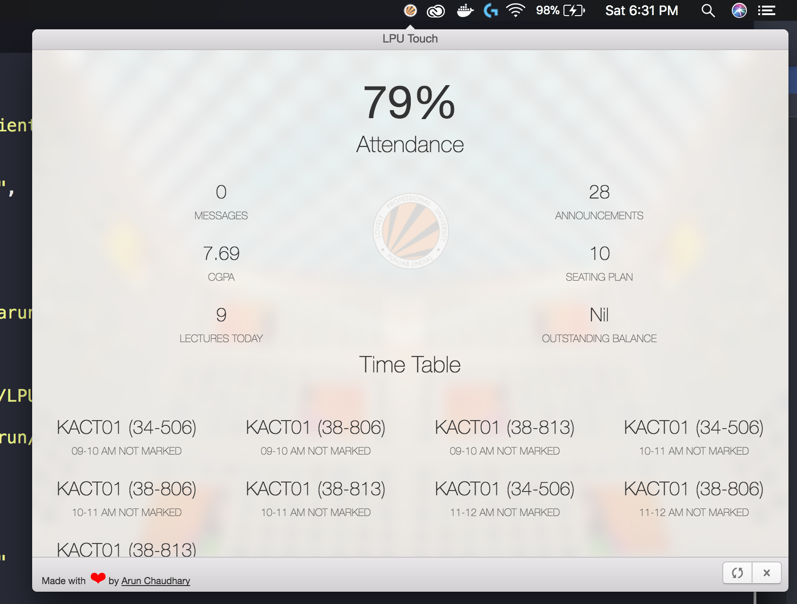

[](https://github.com/its-arun/LPU-Touch-Electron/blob/master/LICENSE.md)
[](#)   

# LPU Touch Electron [Initial Release]
### For those who want LPU Touch on their desktop.
### Available for macOS:apple:, Linux:penguin: and Windows:checkered_flag:.


An electron based tray application for Mac OSX , Linux and Windows that makes it easier to check UMS.

Currently the application only displays basic data like Attendance, CGPA, Time Table etc. In the future release it will have almost all functionality of LPU Touch android application.


#### TODO
+ Make UI beautiful
+ Ability to read messages and announcements
+ Check Assignment marks
+ and more (probably)

### Usage
+ Clone this repository 
+ Edit line 16,17,18 in /LPU-Touch-Electron/src/index.js with your own data
+ Follow these steps
```
npm install
npm run dist
```
+ You can find installer package inside /dist/

### Screenshots




